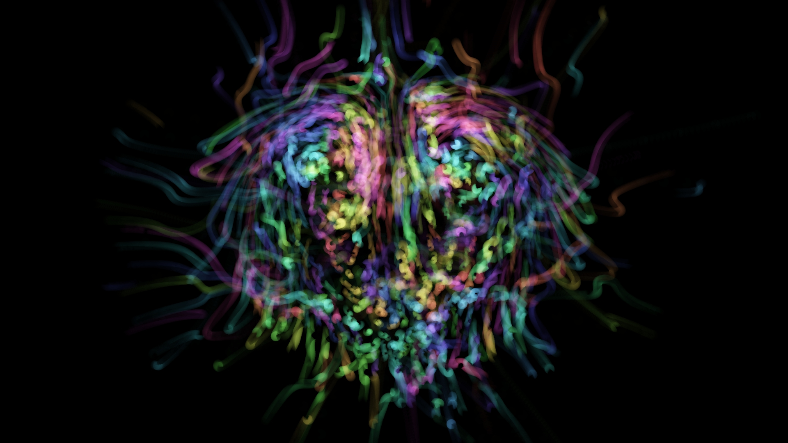

This is a [loopin](https://github.com/koopero/loopin) example project implementing a strange, psychedelic particle system with some basic cellular automata properties. The demo was originally inspired by [Escape Motion's BioLabratory Experiment](https://www.escapemotions.com/experiments/biolab/index.php). This project is still a work in progress; there are no docs and the shader code is pretty ugly. It is based off the [looping starter project](https://github.com/koopero/loopin-starter).

